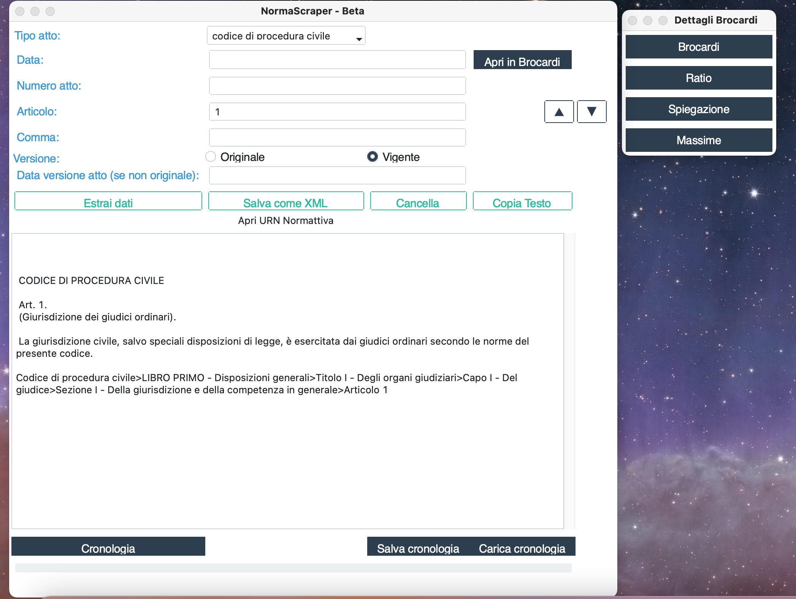

<!-- Improved compatibility of back to top link: See: https://github.com/othneildrew/Best-README-Template/pull/73 -->

`<a name="readme-top"></a>`

<!--
*** Thanks for checking out the Best-README-Template. If you have a suggestion
*** that would make this better, please fork the repo and create a pull request
*** or simply open an issue with the tag "enhancement".
*** Don't forget to give the project a star!
*** Thanks again! Now go create something AMAZING! :D
-->

<!-- PROJECT SHIELDS -->

<!--
*** I'm using markdown "reference style" links for readability.
*** Reference links are enclosed in brackets [ ] instead of parentheses ( ).
*** See the bottom of this document for the declaration of the reference variables
*** for contributors-url, forks-url, etc. This is an optional, concise syntax you may use.
*** https://www.markdownguide.org/basic-syntax/#reference-style-links
-->

[Contributors][contributors-url]
[Forks][forks-url]
[Stargazers][stars-url]
[Issues][issues-url]
[CC0-1.0 License][license-url]

<!-- PROJECT LOGO -->

<br />
<div align="center">
  <a href="https://github.com/capazme/NormaScraperApp">
    
  </a>

<h3 align="center">NORMASCRAPER - BETA</h3>

<p align="center">
    Semplice interfaccia per accedere al sito del governo italiano Normattiva
    <br />
    <br />
    <br />
    ·
    <a href="https://github.com/capazme/NormaScraperApp/issues/new?labels=bug&template=bug-report---.md">Report Bug</a>
    ·
    <a href="https://github.com/capazme/NormaScraperApp/issues/new?labels=enhancement&template=feature-request---.md">Request Feature</a>
  </p>
</div>

<!-- TABLE OF CONTENTS -->

<details>
  <summary>Table of Contents</summary>
  <ol>
    <li>
      <a href="#about-the-project">About The Project</a>
      <ul>
        <li><a href="#built-with">Built With</a></li>
      </ul>
    </li>
    <li>
      <a href="#getting-started">Getting Started</a>
      <ul>
        <li><a href="#prerequisites">Prerequisites</a></li>
        <li><a href="#installation">Installation</a></li>
      </ul>
    </li>
    <li><a href="#usage">Usage</a></li>
        <ul>
        <li><a href="#spec">Prerequisites</a></li>
      </ul>
    <li><a href="#roadmap">Roadmap</a></li>
    <li><a href="#contributing">Contributing</a></li>
    <li><a href="#license">License</a></li>
    <li><a href="#contact">Contact</a></li>
    <li><a href="#acknowledgments">Acknowledgments</a></li>
  </ol>
</details>

<!-- ABOUT THE PROJECT -->

## About The Project

NormaScraperApp è un'applicazione Python che fornisce un'interfaccia utente per accedere a Normattiva, il sito del governo italiano che ospita la legislazione nazionale. L'applicazione permette agli utenti di cercare atti legislativi specifici, visualizzare i dettagli e salvare i risultati.

<p align="right">(<a href="#readme-top">back to top</a>)</p>

### Built With

<p align="right">(<a href="#readme-top">back to top</a>)</p>

<!-- GETTING STARTED -->

## Getting Started

This is an example of how you may give instructions on setting up your project locally.
To get a local copy up and running follow these simple example steps.

### Prerequisites

#### Nessun prerequisito per l'applicazione contenuta nel file .zip.

#### Python e pip sono necessari per costruire dalla fonte.

### Installation

1. Clona la repository
2. ```sh
   git clone https://github.com/capazme/NormaScraperApp.git
   ```
3. Istalla le librerie python necessarie
   ```sh
   pip install -r resources/requirements.txt
   ```
4. Avvia NormaScraper.py con python 3.12 o superiore
   ```js
   python -m NormaScraper.py
   ```

<p align="right">(<a href="#readme-top">back to top</a>)</p>

<!-- USAGE EXAMPLES -->

## Usage

<div align="center">
  <a href="https://github.com/capazme/NormaScraperApp">
    
  </a>
<p align="right">(<a href="#readme-top">back to top</a>)</p>

### Spec

##### get_urn_and_extract_data()

La funzione get_urn_and_extract_data è progettata per interrogare il sito Normattiva, utilizzando **l'URN** (Uniform Resource Name) per identificare specifici atti legislativi. Una volta ottenuto l'accesso all'atto desiderato, la funzione estrae dati rilevanti che possono includere testo dell'atto, date di promulgazione, modifiche successive, e altro ancora. I parametri principali della funzione includono:

* act_type (str): Il tipo di atto legislativo per cui si desidera generare l'URN.

  * **atto generico** (legge, decreto-legge, decreto legislativo e possibili abbreviazioni)
  * **atto specifico** tra quelli elencati (o una abbraviazione elencata):
    * Costituzione (costituzione, cost, cost., c.)
    * Codice Civile (cc, c.c., codice civile, cod. civ., disp. att. c.c.)
    * Preleggi (disp. prel., preleggi, prel.)
    * Codice Penale (cp, c.p., cod. pen.)
    * Codice di Procedura Civile (cpc, c.p.c., cod. proc. civ., disp. att. c.p.c.)
    * Codice di Procedura Penale (cpp, c.p.p., cod. proc. pen.)
    * Codice della Navigazione (cn, cod. nav.)
    * Codice Postale e delle Telecomunicazioni (cpet, cod. post. telecom.)
    * Codice della Strada (cds, cod. strada)
    * Codice del Processo Tributario (cpt, cod. proc. trib.)
    * Codice in Materia di Protezione dei Dati Personali (cpd, cod. prot. dati)
    * Codice delle Comunicazioni Elettroniche (cce, cod. com. elet.)
    * Codice dei Beni Culturali e del Paesaggio (cbc, cod. beni cult.)
    * Codice della Proprietà Industriale (cpi, cod. prop. ind.)
    * Codice dell'Amministrazione Digitale (cad, cod. amm. dig.)
    * Codice della Nautica da Diporto (cnd, cod. naut. diport.)
    * Codice del Consumo (cdc, cod. consumo)
    * Codice delle Assicurazioni Private (cap, cod. ass. priv.)
    * Norme in Materia Ambientale (camb, norme amb.)
    * Codice dei Contratti Pubblici (ccp, cod. contr. pubb.)
    * Codice delle Pari Opportunità (cpo, cod. pari opp.)
    * Codice dell'Ordinamento Militare (com, cod. ord. mil.)
    * Codice del Processo Amministrativo (cpa, cod. proc. amm.)
    * Codice del Turismo (ctu, cod. turismo)
    * Codice Antimafia (cam, cod. antimafia)
    * Codice di Giustizia Contabile (cgco, cod. giust. cont.)
    * Codice del Terzo Settore (cts, cod. ter. sett.)
    * Codice della Protezione Civile (cdpc, cod. prot. civ.)
    * Codice della Crisi d'Impresa e dell'Insolvenza (cci, cod. crisi imp.)"
    * date (str, optional): La data di pubblicazione dell'atto in formato YYYY-MM-DD.
* act_number (str, optional): Il numero dell'atto legislativo.
* article (str, optional): Il numero dell'articolo all'interno dell'atto legislativo.(con eventuali estensioni, come "-bis" o "-ter".)
* version (str, optional): Indica se l'atto è nella versione "originale" o "vigente".
* version_date (str, optional): La data della versione dell'atto in formato YYYY-MM-DD.

  ---

<!-- ROADMAP -->

## Roadmap

- [ ] Feature 1
- [ ] Feature 2
- [ ] Feature 3
  - [ ] Nested Feature

See the [open issues](https://github.com/capazme/NormaScraperApp/issues) for a full list of proposed features (and known issues).

<p align="right">(<a href="#readme-top">back to top</a>)</p>

<!-- CONTRIBUTING -->

## Contributing

<p align="right">(<a href="#readme-top">back to top</a>)</p>

<!-- LICENSE -->

## License

Distributed under the CC0-1.0 License. See `LICENSE.txt` for more information.

<p align="right">(<a href="#readme-top">back to top</a>)</p>

<!-- CONTACT -->

## Contact

Guglielmo Puzio - - guglielmo.puzio00@gmail.com - guglielmo.puzio@studenti.luiss.it (ancora per un po')

Project Link: [https://github.com/capazme/NormaScraperApp](https://github.com/capazme/NormaScraperApp)

<p align="right">(<a href="#readme-top">back to top</a>)</p>

<!-- ACKNOWLEDGMENTS -->

## Acknowledgments

<p align="right">(<a href="#readme-top">back to top</a>)</p>

<!-- MARKDOWN LINKS & IMAGES -->

<!-- https://www.markdownguide.org/basic-syntax/#reference-style-links -->

```

```

[contributors-url]: https://github.com/capazme/NormaScraperApp/graphs/contributors
[forks-shield]: https://img.shields.io/github/forks/capazme/NormaScraperApp.svg?style=for-the-badge
[forks-url]: https://github.com/capazme/NormaScraperApp/network/members
[stars-shield]: https://img.shields.io/github/stars/capazme/NormaScraperApp.svg?style=for-the-badge
[stars-url]: https://github.com/capazme/NormaScraperApp/stargazers
[issues-shield]: https://img.shields.io/github/issues/capazme/NormaScraperApp.svg?style=for-the-badge
[issues-url]: https://github.com/capazme/NormaScraperApp/issues
[license-shield]: https://img.shields.io/github/license/capazme/NormaScraperApp.svg?style=for-the-badge
[license-url]: https://github.com/capazme/NormaScraperApp/blob/master/LICENSE.txt
[linkedin-shield]: https://img.shields.io/badge/-LinkedIn-black.svg?style=for-the-badge&logo=linkedin&colorB=555
[product-screenshot]: resources/screen.png
[contributors-shield]: https://img.shields.io/github/contributors/capazme/NormaScraperApp.svg?style=for-the-badge
